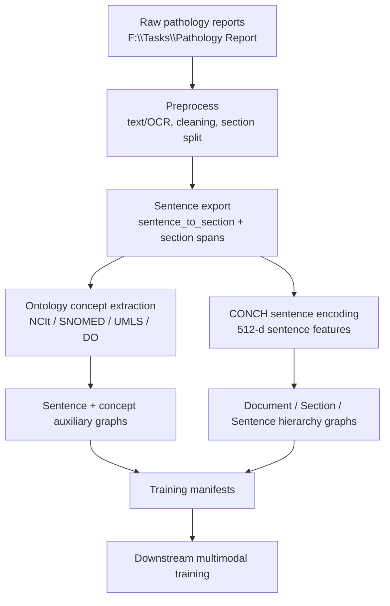

# Pathology Report Workflow

The current report pipeline turns raw pathology reports into sentence features,
hierarchy graphs, ontology concept graphs, and training manifests.

## Main Outputs

- `Output/pathology_report_preprocessed_masked/`
- `Output/sentence_exports_masked/`
- `Output/concept_annotations_masked/`
- `Output/sentence_embeddings_conch_masked/`
- `Output/text_hierarchy_graphs_masked/`
- `Output/manifests/`

Ontology ablation outputs live under `Output/concept_annotations_ablation/` and
the corresponding graph folders.

## Current Modeling Use

The training side treats the original sentence feature branch as the primary
text signal. Hierarchy graphs and ontology concept graphs are auxiliary
enhancements, not replacements for the sentence-only baseline.
