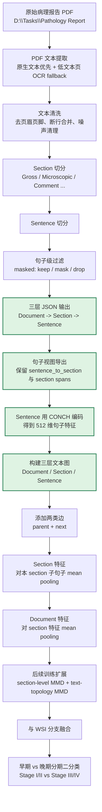

# 病理报告文本到层次图的当前流程

## 一句话概括

当前已经完成到：

`原始 PDF -> 文本提取/OCR -> 清洗 -> Section 切分 -> Sentence 切分 -> masked 过滤 -> 三层 JSON -> 句子导出 -> CONCH 句子特征 -> 第一版三层文本图`

后续还没做的是：

`图上的训练与对齐 -> section/doc pooling 训练接入 -> section-level MMD -> text-topology MMD -> 与 WSI 融合`

## 当前完整流程线

## 当前已完成的目录

- 三层预处理 JSON：
  - `D:\Tasks\isbi_code\pathology_report_extraction\Output\pathology_report_preprocessed_masked`
- 句子导出结果：
  - `D:\Tasks\isbi_code\pathology_report_extraction\Output\sentence_exports_masked`
- 句子级 CONCH 特征：
  - `D:\Tasks\isbi_code\pathology_report_extraction\Output\sentence_embeddings_conch_masked`
- 第一版三层文本图：
  - `D:\Tasks\isbi_code\pathology_report_extraction\Output\text_hierarchy_graphs_masked`

## 当前图设计

第一版图刻意保持简单：

1. 节点只有三层
   - `Document`
   - `Section`
   - `Sentence`
2. 边只保留两类
   - `parent`
   - `next`
3. 特征来源保持和论文兼容
   - `Sentence`：直接使用 CONCH 512 维文本特征
   - `Section`：对子句子特征做 mean pooling
   - `Document`：对 section 特征做 mean pooling

## 下一步

最自然的下一步是：

1. 读取 `Output\text_hierarchy_graphs_masked`
2. 把 `Document / Section / Sentence` 三层表示接入文本图分支
3. 在文本图上补：
   - `section-level MMD`
   - `text-topology MMD`
4. 再与 WSI 分支融合
